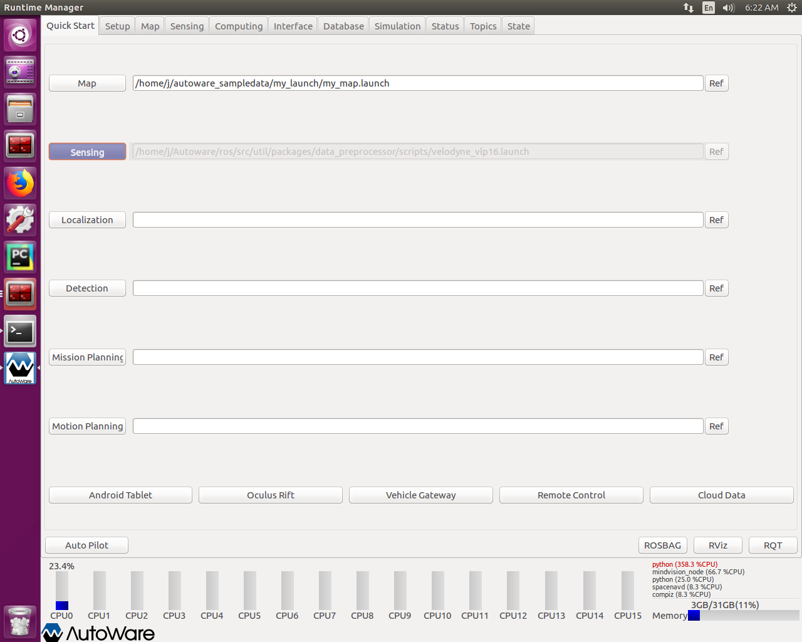
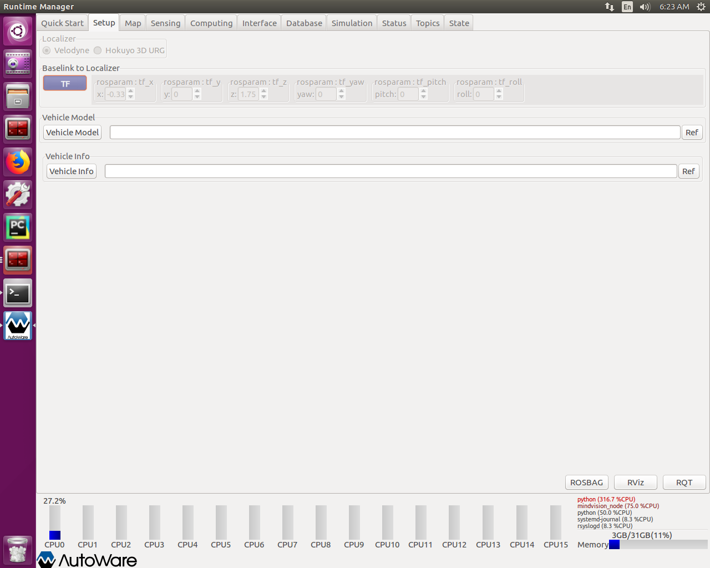
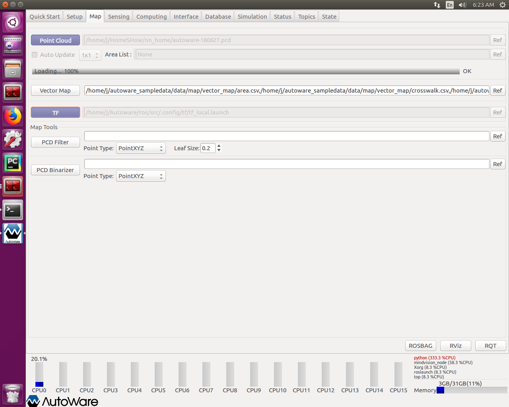
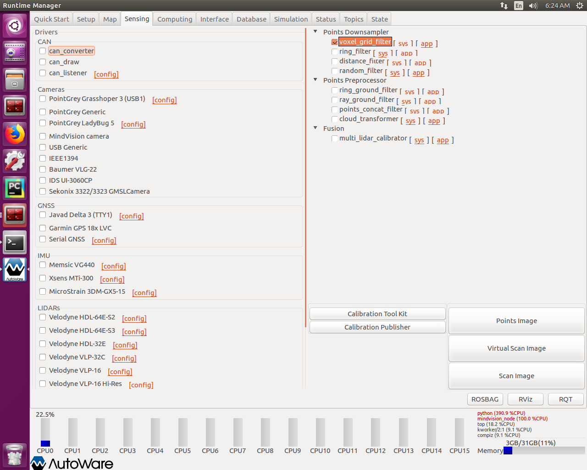
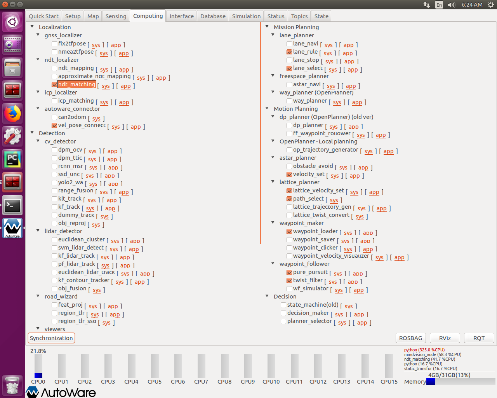
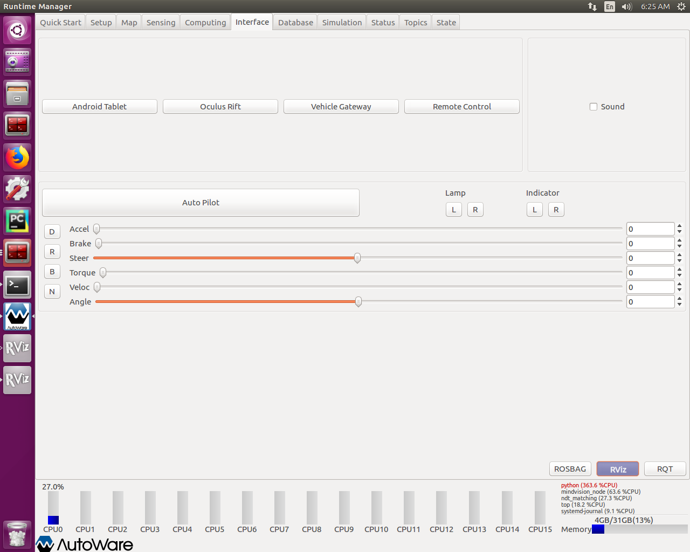
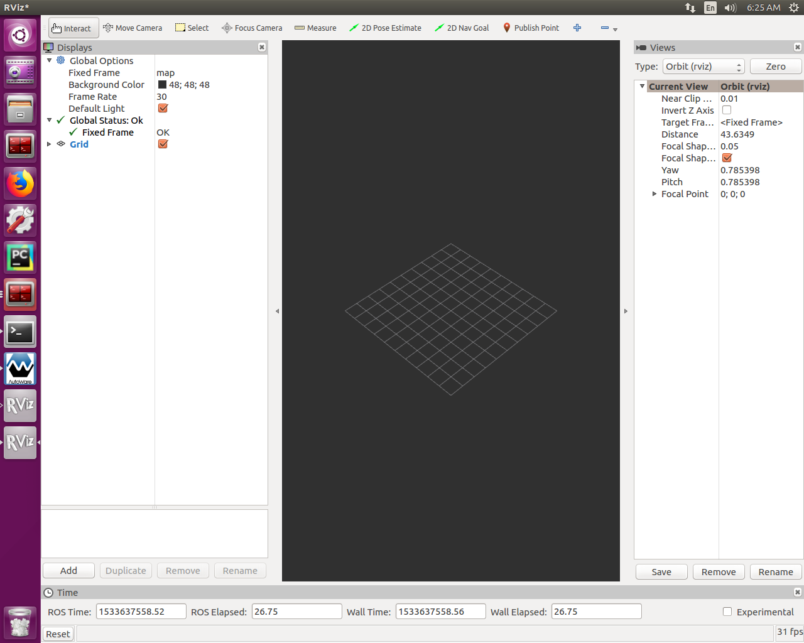
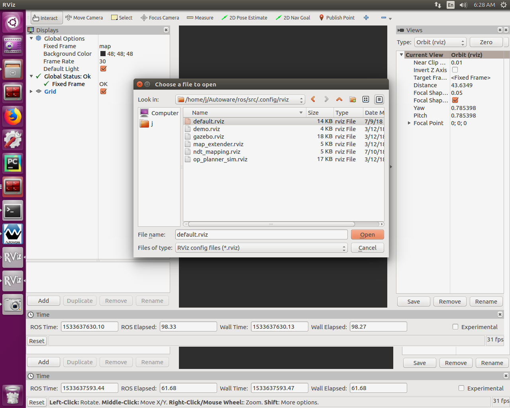
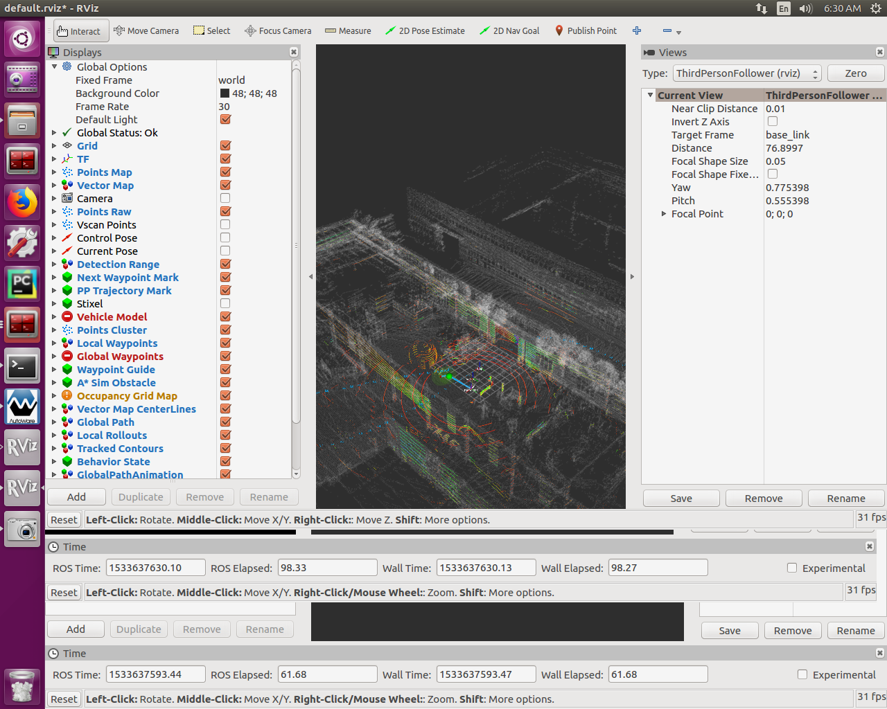
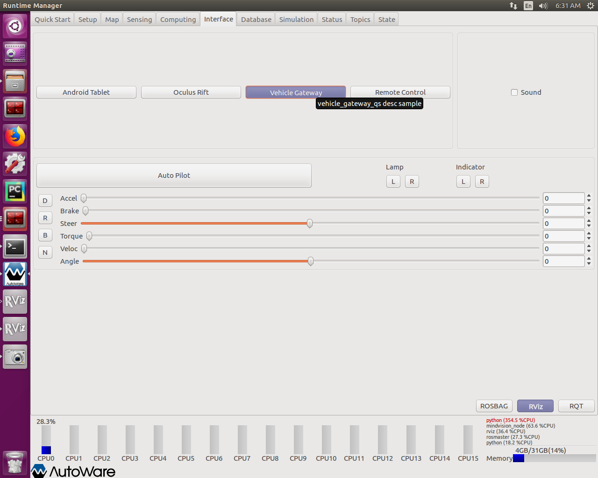

## 打开一个终端，启动 ROS
```bash
$ roscore
```
## 打开另外一个终端，启动相机驱动
```bash
$ cd catkin_ws
$ sudo su 
$ source devel/setup.bash 
$ rosrun mindvision mindvision_node 
```
## 打开另一个终端，启动 Udacity 分类器
```bash
$ cd CarND-Capstone/ros
$ source devel/setup.bash
$ roslaunch launch/styx.launch
```
## 打开另一个终端，启动 Autoware
```bash
$ cd Autoware/ros
$ ./run
```
## 配置Autoware
### 步骤 1：

### 步骤 2：

### 步骤 3：

### 步骤 4：

### 步骤 5：

### 步骤 6：

### 步骤 7：

### 步骤 8：

### 步骤 9：

### 步骤 10：



## 其他帮助
1. 你可以打开一个图像监控窗口来观察相机捕获的图像：
```bash
$ rosrun rqt_image_view rqt_image_view
```
2. 分类结果通过话题`/chatter`传输给 Autoware，你可以打开另外一个中断查看这个话题的发布：
```bash
$ rostopic echo /chatter
```
3. 你可以打开 ROS 节点关系图，查看分类器，Autoware 相关节点和相机节点的连接：
```bash
$ rosrun rqt_graph rqt_graph
```

